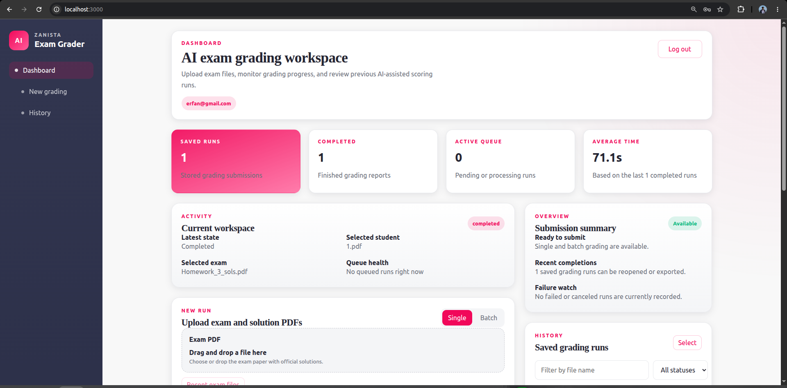
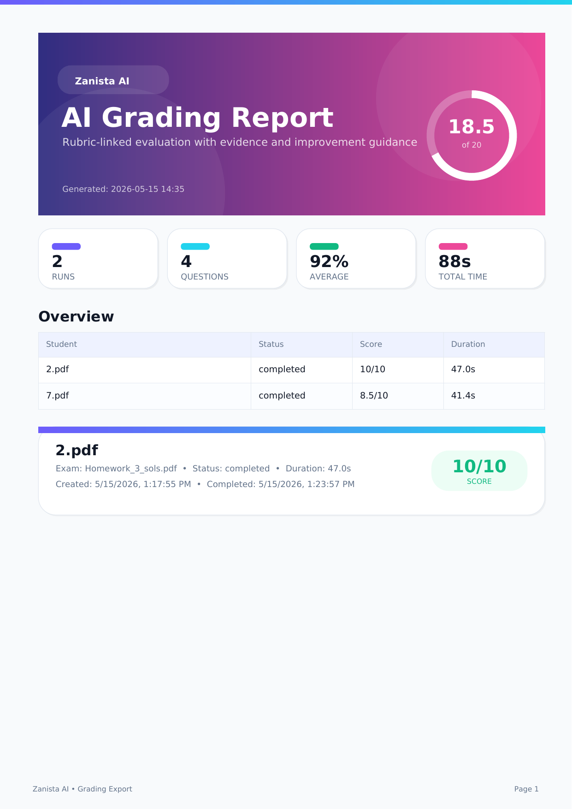

# Zanista Intern Takehome

## Overview

This repository contains an authenticated AI exam grading system with:

- a Django + Django REST Framework backend
- a Next.js frontend
- persistent grading history per user
- Azure OpenAI based grading
- PDF export for saved grading runs

The backend owns authentication, file handling, persistence, grading orchestration, and export. The frontend is a browser client for authentication, upload, history, and result review.

## Repository Structure

- `backend/`: Django API, grading engine, persistence, PDF export
- `frontend/`: Next.js UI
- `backend/grading_engine/`: PDF preprocessing, orchestration, Azure OpenAI client
- `docs/samples/`: sample PDFs used for regression/manual testing

## Requirements

- Docker
- Docker Compose
- Azure OpenAI credentials for the deployment `gpt-5.4-mini`

## Environment Variables

Copy the example file:

```bash
cp .env.example .env
```

Then fill in real values locally. Do not commit `.env`.

Required Azure/OpenAI settings:

| Variable | Purpose |
|---|---|
| `AZURE_OPENAI_API_KEY` | Azure OpenAI API key |
| `AZURE_OPENAI_ENDPOINT` | Azure OpenAI endpoint URL |
| `AZURE_OPENAI_DEPLOYMENT` | Azure deployment name. This project is intended to use `gpt-5.4-mini` only |
| `AZURE_OPENAI_API_VERSION` | Azure OpenAI API version |

Required backend settings:

| Variable | Purpose |
|---|---|
| `DJANGO_SECRET_KEY` | Django secret key |
| `JWT_SECRET_KEY` | JWT signing key for backend bearer tokens |

Common local settings:

| Variable | Purpose |
|---|---|
| `DATABASE_URL` | Database connection string. Default is SQLite at `/app/data/app.db` |
| `STORAGE_ROOT` | Persistent storage root for uploads and artifacts |
| `CORS_ALLOW_ALL_ORIGINS` | CORS override |
| `CORS_ALLOWED_ORIGINS` | Allowed browser origins |
| `NEXT_PUBLIC_API_BASE_URL` | Frontend API base URL |
| `ALLOW_MOCK_GRADING` | Enables local mock grading instead of Azure |
| `PDF_MAX_PAGE_DIMENSION` | Preprocessing page cap |
| `PDF_MAX_ZOOMED_DIMENSION` | Zoomed evidence page cap |

## Running With Docker

From the repository root:

```bash
docker compose up --build
```

Default local URLs:

- Frontend: `http://localhost:3000`
- Backend API base: `http://localhost:8000/api`
- Health check: `http://localhost:8000/api/health`
- OpenAPI schema: `http://localhost:8000/api/schema/`
- Swagger UI: `http://localhost:8000/api/docs/`
- ReDoc: `http://localhost:8000/api/redoc/`

## API Endpoints

All API routes are under `/api`.

Authentication:

- `POST /api/auth/register`
- `POST /api/auth/login`
- `GET /api/auth/me`

Gradings:

- `POST /api/gradings`
- `POST /api/gradings/batch`
- `GET /api/gradings`
- `GET /api/gradings/{id}`
- `GET /api/gradings/{id}/status`
- `PATCH /api/gradings/{id}/cancel`
- `PATCH /api/gradings/{id}/override`
- `POST /api/gradings/export`

## Authentication

Authentication is enforced by the backend.

- protected endpoints use backend bearer-token authentication
- unauthenticated requests to protected routes are rejected
- passwords are hashed using Django’s password hashing system
- grading records are scoped per authenticated user
- one user cannot retrieve another user’s grading runs by editing frontend state or request parameters

The frontend stores the bearer token client-side and sends it in the `Authorization: Bearer ...` header, but authorization is validated server-side.

## Database and Persistence

The project uses a database configured by `DATABASE_URL`.

Default local/container setup:

- database engine: SQLite
- database path in the container: `/app/data/app.db`
- Docker volume: `grader_data`

Persistent grading files and artifacts are stored under:

- `/app/storage`
- Docker volume: `grader_storage`

This means saved gradings and uploaded artifacts are designed to survive container restarts.

## Grading Flow

High-level request flow:

1. A user registers or logs in.
2. The browser uploads an exam PDF and a student PDF.
3. The backend stores the files and creates a `GradingRun`.
4. The grading engine preprocesses PDFs and sends structured grading requests to Azure OpenAI.
5. Results are validated and persisted.
6. The user can reopen past gradings later from history.
7. The user can export selected runs as a PDF report.

Batch mode creates multiple `GradingRun` records, one per student file.

## Azure OpenAI Configuration

The grading system is wired to Azure OpenAI through environment variables.

Current runtime checks and expectations:

- credentials come from env vars
- the configured deployment is compared against the allowed deployment constant
- the intended deployment is `gpt-5.4-mini`
- there is no public OpenAI client path in the grading runtime

## PDF Export

Saved grading runs can be exported through:

- `POST /api/gradings/export`

The current project includes a styled PDF export path on the backend and the frontend export action calls that backend endpoint.

### Site Demo

Repository preview of the grading dashboard UI:

- Demo image: `docs/previews/site-demo-dashboard.png`



### Export Preview

Repository demo assets for the generated grading export:

- Preview image: `docs/previews/grading-export-demo-preview.png`
- Demo PDF: `docs/previews/grading-export-demo.pdf`

[](docs/previews/grading-export-demo.pdf)

## Testing

Useful backend test commands:

```bash
python3 backend/manage.py test apps.grading.tests
python3 backend/manage.py test apps.grading.test_exam_cache apps.grading.test_grading_quality apps.grading.test_azure_client
```

With Docker:

```bash
docker compose exec backend python manage.py test apps.grading.tests apps.grading.test_exam_cache apps.grading.test_grading_quality apps.grading.test_azure_client
```

## Design Decisions

- Django/DRF for auth, persistence, and API boundaries
- Next.js for the browser UI
- SQLite by default for simple local persistence
- Azure OpenAI integration isolated in `backend/grading_engine`
- PDF preprocessing and evidence extraction kept in the backend
- saved grading runs modeled explicitly so past work can be re-opened and exported

## Known Limitations

The checklist below reflects the current branch as it exists now, not an ideal target state.

- The repository includes the required backend API, real auth, persistence, and Azure/OpenAI env-driven configuration.
- The backend grading worker enforces `HARD_TIMEOUT_SECONDS=120` internally.
- The current grading submit endpoint does not currently document or guarantee an HTTP `504` response path in the default runtime branch.
- The current Docker backend image starts Gunicorn directly; if the database schema is missing, migration handling should be verified in the runtime environment.
- The current `.env.example` contains a concrete endpoint placeholder rather than a generic placeholder string.
- The frontend stores the bearer token in local storage, which is acceptable for this project but not ideal for a production security model.

## Compliance Checklist Notes

Against the automatic-rejection checklist, the codebase currently contains these implemented pieces:

- backend HTTP API
- real backend authentication
- hashed passwords
- persistence in a database
- per-user grading history
- Azure OpenAI env-var based configuration
- deployment restriction logic for `gpt-5.4-mini`

Items that should be verified carefully on the current branch before submission:

- `docker compose up` from a clean clone with no manual migration/setup step
- strict HTTP `504` behavior for grading requests that exceed 120 seconds
- repository hygiene for `.env`, DB files, and other local artifacts

## AI Tool Usage

AI tools were used for implementation assistance, debugging, prompt refinement, export integration, and documentation support. Final repository behavior should still be verified directly through Docker and backend tests.

## Troubleshooting

### Backend starts but grading fails

Check:

- `AZURE_OPENAI_API_KEY`
- `AZURE_OPENAI_ENDPOINT`
- `AZURE_OPENAI_DEPLOYMENT`
- `AZURE_OPENAI_API_VERSION`

### Browser cannot reach the API

Check:

- backend is running on port `8000`
- frontend is using `NEXT_PUBLIC_API_BASE_URL=http://localhost:8000/api`
- CORS origins match your local browser origin

### Need to reset local persisted state

```bash
docker compose down -v
```

### Sample files for manual testing

Included under:

- `docs/samples/Q&A/`
- `docs/samples/studentAnswers/`
